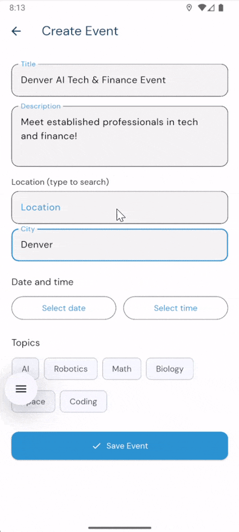

# STEM Ecosystem Mobile Application

## App Demo

  
  
  

## Overview
The STEM Ecosystem Mobile Application is a cross-platform, location-aware mobile app designed to connect students and educators with relevant STEM events, mentors, and organizations across Colorado. The app provides personalized content based on user interests and location, with real-time updates and push notifications.

## Technologies Used
- Flutter (cross-platform mobile development)
- Firebase Authentication
- Firebase Firestore (NoSQL database)
- Firebase Cloud Messaging (push notifications)
- Google Maps API
- Jira (Agile project management)
- Git/GitHub (version control)

## Key Features
- Role-based access control for students and mentors
- Personalized onboarding with interest and location selection
- Real-time event feed backed by Firestore
- Push notifications for nearby or interest-matched events
- Google Maps integration for event locations
- Favorites and event registration tracking
- Light/Dark mode theming

## Team
Team Honey Badgers – Senior Capstone Project  
Metropolitan State University of Denver
